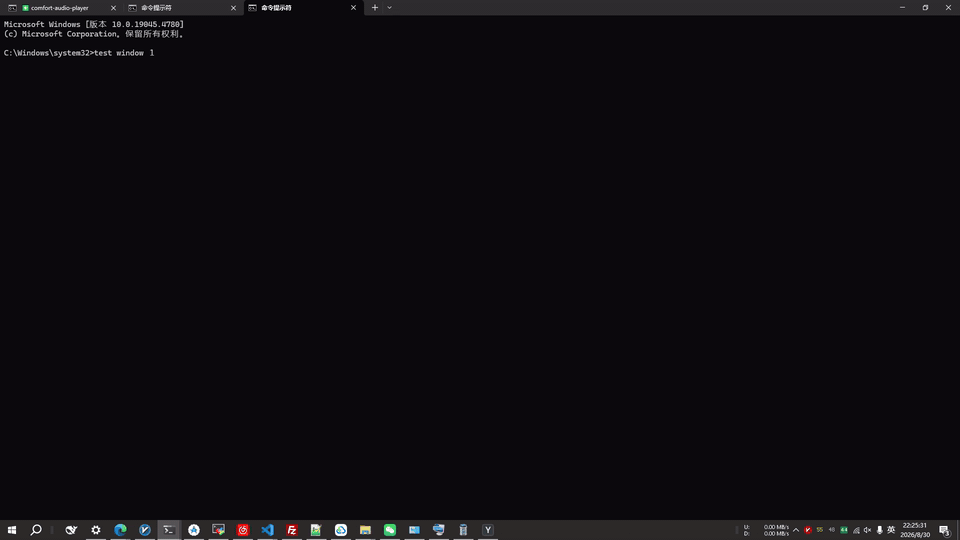

<div align="center">


# WinHop

A fast window switcher for Windows

Bring up a fullscreen picker with a global hotkey, pick a program with letter keys and a window with digit keys. Supports single-letter and multi-letter modes; Space jumps between your two most recent windows.

Rust + Tauri 2 (WebView2) · Windows 10/11 x64

**[中文](README.md)**

</div>

## Demo

Switching between 2 Terminal windows (`t`) and 3 VS Code windows (`v`), plus Space to jump back to the previous window:

<div align="center">
  
</div>

## Why WinHop

- **Keyboard-only, two keystrokes to any window**: `Ctrl+Space` to open, a letter for the program, a digit for the window. Hands stay on the keyboard.
- **Switching only, not a launcher**: the list is what you see. Running programs are reached directly by their code; non-running ones are greyed out and not selectable. No extra clutter.
- **A two-layer model that keeps you oriented**: program layer then window layer, where multi-window programs show thumbnails plus a large preview.
- **Codes you can read at a glance**: solid bright badge = configured and running, a `·` placeholder = no letter assigned (click to pick, use ✎ to assign one), grey = configured but not running.
- **Lightweight and resident**: lives in the tray, single instance; runs elevated so it can switch admin windows like Task Manager.
- **Simple, reliable config**: plain JSON in your user directory, survives upgrades/reinstalls, safe to commit to version control.

## Features

- **Two-layer key model**: `Ctrl+Space` to open → a letter picks a program (single window switches directly / multiple windows enter the window layer) → a digit picks a window.
- **Single-letter / multi-letter modes** (toggle in settings):
  - Single-letter: one letter code per program, one keystroke to reach it.
  - Multi-letter: type letters to filter live by code/name, `Enter` confirms the best match; codes can be multi-letter (e.g. `ch`, `vs`), breaking past the 26-letter limit.
- **Space to jump back**: press Space right after opening to switch to the previously used window (toggle between your two most recent).
- **Pagination**: 20 programs per page, `PageUp/PageDown` to page.
- **Window layer**: number + thumbnail + large preview, arrow keys/hover linked, auto-scroll follows the selection.
- **Unified editing**: every program (configured or not) can be renamed and assigned a code; writes to `config.json` and takes effect immediately.
- **Sorting options**: fixed order (by creation) / most-recently-used first.
- **Multi-monitor**: entries show which screen a window is on; after switching, the window stays on its original screen.
- **Admin programs**: runs elevated to switch UIPI-protected windows such as taskmgr.
- **Themes**: all colors come from CSS-variable themes, switchable in settings; built-in black-green and black-yellow.
- **Settings page**: open with `F2` or the header settings button; changes apply on Save (themes preview live, discarded on cancel).
- **Tray resident**: left-click toggles the picker, right-click menu to quit, single-instance guard.

## Usage

### Install

Download from [GitHub Releases](https://github.com/cnecoder/WinHop/releases):

- **WinHop_x.y.z_x64-setup.exe** (NSIS installer, recommended)
- or **WinHop_x.y.z_x64_en-US.msi**

Requires Windows 10/11 x64 (WebView2 included). On first launch a UAC prompt asks for elevation (required to switch admin programs).

### Open and pick

```
Ctrl+Space (default hotkey, configurable)
  → fullscreen picker lists all programs
    → single-letter mode: press a letter code
    → multi-letter mode: type letters to filter → Enter to confirm
        single-window program → switches directly
        multi-window program → enters the window layer
          → press a digit → switch that window (multi-digit supported)
          → press the same letter again → cycle to the next window
          → ↑↓ to move selection / hover to preview / click to pick
    → Space → switch to the previous window (toggle the two most recent)
    → PageUp/PageDown to page (when more than 20 programs)
    → Esc to step back one layer
  → press the hotkey again / click outside the picker → close
```

- Non-running programs are shown greyed out at the end and are not selectable (switcher, not launcher).
- Running unconfigured programs are still listed with a `·` placeholder: they're clickable to switch, but no letter is auto-assigned (assign one manually with ✎; clearing the letter and saving unbinds it).
- Each window-layer row: number + title + screen tag + small thumbnail; the large preview on the right follows selection/hover.

### Edit a program

Each program row has an edit button (✎) on the right: click → enter a code (a single letter in single-letter mode, with available letters shown below; a multi-letter code in multi-letter mode, or leave blank to match by name only) → change the name → Save. It is written to `config.json` immediately.

### Settings

Press **F2** in the picker or click the header **Settings** button to open the settings page:

- **Window order**: fixed (by creation) / most-recently-used first
- **Multi-letter mode** toggle
- **Theme** switch
- **Quit WinHop**
- Current version and its release notes

Changes apply only after you click **Save**; going back or pressing Esc with unsaved changes prompts you to save.

### Tray

- **Left-click** the tray icon: toggle the picker
- **Right-click**: menu with **Quit**

## Configuration

The config file `config.json` lives in `%APPDATA%\WinHop\` (survives upgrades/reinstalls). Config from older versions (`%APPDATA%\WinTab`, next to the exe, or the project root) is copied over automatically on first run; old files are kept. A default config is generated when none exists.

```json
{
  "hotkey": "ctrl+space",
  "elevate": true,
  "window_order": "zorder",
  "multi_letter": false,
  "theme": "black-green",
  "programs": [
    { "key": "c", "multi_key": "ch", "name": "Chrome", "process": "chrome.exe" },
    { "key": "v", "multi_key": "vs", "name": "VS Code", "process": "code.exe" }
  ]
}
```

| Field | Description |
|---|---|
| `hotkey` | Global hotkey, format `modifier+key`: ctrl/alt/shift/win + space/esc/enter/tab/letter/digit |
| `elevate` | Whether the release build runs elevated (required for admin programs; ignored in debug) |
| `window_order` | Window-layer order: `zorder` fixed (by creation) / `mru` most-recently-used first. Changeable in settings. |
| `multi_letter` | Whether multi-letter mode is enabled (changeable in settings). |
| `theme` | Theme id (changeable in settings); built-in `black-green` and `black-yellow`, defaults to `black-green`. |
| `programs[]` | Program entries: `key` single-letter code (one lowercase letter, may be empty), `multi_key` multi-letter code (lowercase letters, may be empty), `name` display name, `process` exe file name (lowercase). |

`key` and `multi_key` are each unique and may each be empty (when using only the other mode). The default config ships with two sets of codes for common software. Edits made via the settings page or ✎ are saved to this file immediately.

## Support

WinHop is free and open source, and it will stay that way. If it genuinely saves you time and you'd like to, you can buy the author a coffee — it's a huge encouragement to keep maintaining it. Sponsoring is entirely optional and never required to use the app.

<div align="center">
  
  
  
</div>
